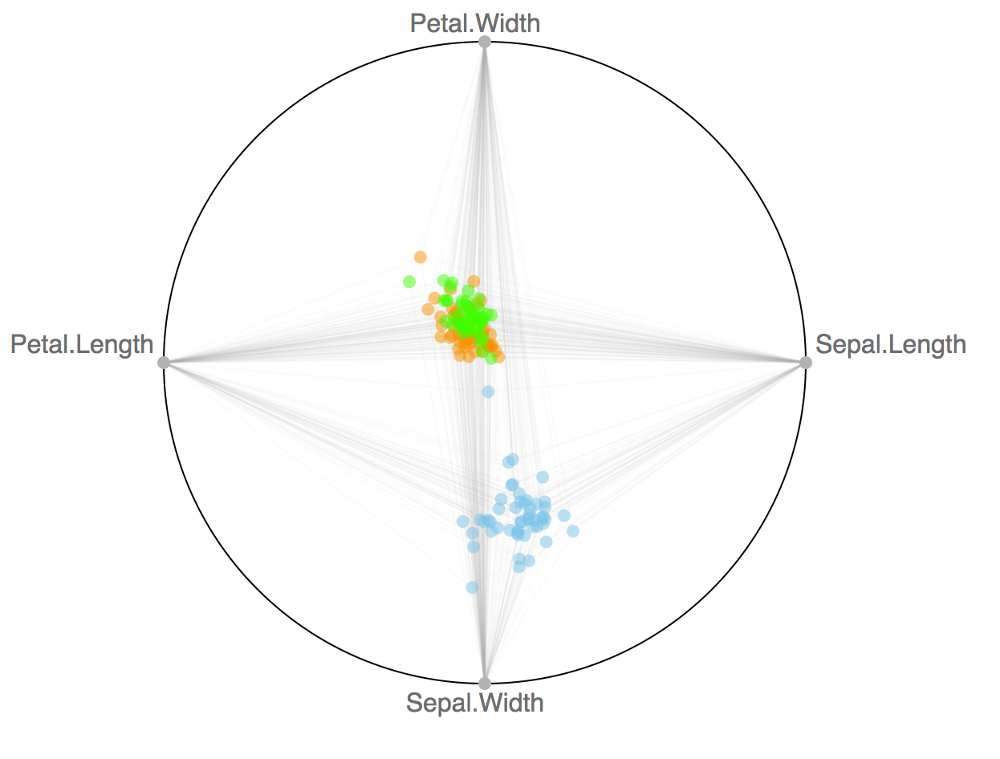

---
output:
  html_document:
    keep_md: true
  md_document:
    variant: markdown_github
---

`radviz` : an htmlwidget for [https://github.com/biovisualize/radviz](https://github.com/biovisualize/radviz)

See <https://github.com/biovisualize/radviz> for more info.

This is a super-basic widget that's looking for a home (i.e pls take over development! :-)

NOTE: The tooltip `<div>` is not uniquely id'd so that means weird behavior with multiples of these on one page.

File an issue with the parent JS lib if you want to work on tooltips.

The following functions are implemented:

- `add_color`:	Add color to the charts
- `add_dimensions`:	Add the columns (dimensions) you wish to map in the radviz
- `add_tooltip`:	Add a tooltip to a radviz widget
- `radviz`:	Make a radviz

The following data sets are included:

### Installation

```{r eval=FALSE}
devtools::install_github("hrbrmstr/radviz")
```

```{r echo=FALSE, message=FALSE, warning=FALSE, error=FALSE}
options(width=120)
```

### Usage

```{r}
library(radviz)

# current verison
packageVersion("radviz")
```
```{r eval=FALSE}

radviz(iris, diameter=600, margin=100, 
       use_repulsion=TRUE, draw_links=TRUE, 
       width=600, height=500) %>% 
  add_dimensions(c('Sepal.Length', 'Sepal.Width', 
                   'Petal.Length', 'Petal.Width')) %>% 
  add_color("Species") %>% 
  add_tooltip("function(d){ return 'Petal width: ' + d['Petal.Length']; }")

```



### Test Results

```{r}
library(radviz)
library(testthat)

date()

test_dir("tests/")
```

