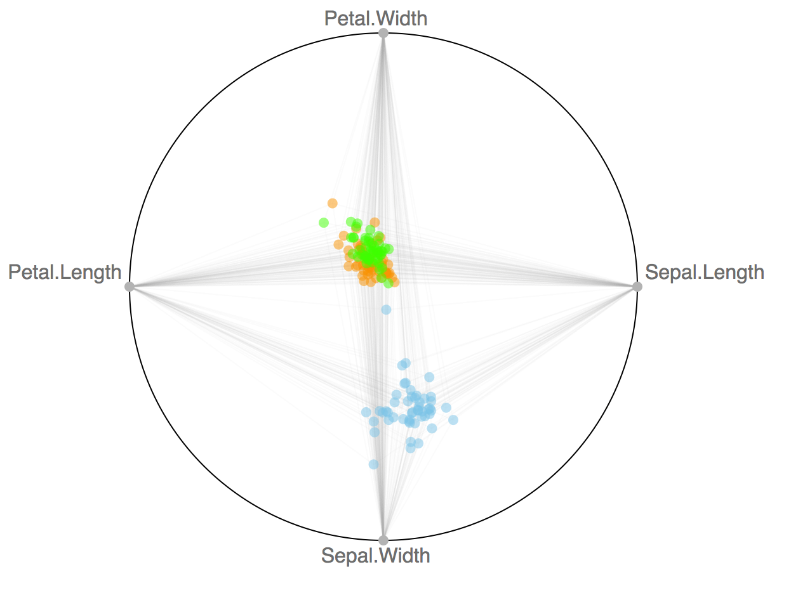

`radviz` : an htmlwidget for [https://github.com/biovisualize/radviz](https://github.com/biovisualize/radviz)

See <https://github.com/biovisualize/radviz> for more info.

This is a super-basic widget that's looking for a home (i.e pls take over development! :-)

The following functions are implemented:

- `add_color`:	Add color to the charts
- `add_dimensions`:	Add the columns (dimensions) you wish to map in the radviz
- `add_tooltip`:	Add a tooltip to a radviz widget
- `radviz`:	Make a radviz

The following data sets are included:

### Installation


```r
devtools::install_github("hrbrmstr/radviz")
```


### Usage


```r
library(radviz)

# current verison
packageVersion("radviz")
```

```
## [1] '0.1.0'
```

```r
radviz(iris, diameter=600, margin=100, 
       use_repulsion=TRUE, draw_links=TRUE, 
       width=600, height=600) %>% 
  add_dimensions(c('Sepal.Length', 'Sepal.Width', 
                   'Petal.Length', 'Petal.Width')) %>% 
  add_color("Species")
```



### Test Results


```r
library(radviz)
library(testthat)

date()
```

```
## [1] "Thu Mar  3 12:56:27 2016"
```

```r
test_dir("tests/")
```

```
## testthat results ========================================================================================================
## OK: 0 SKIPPED: 0 FAILED: 0
```

